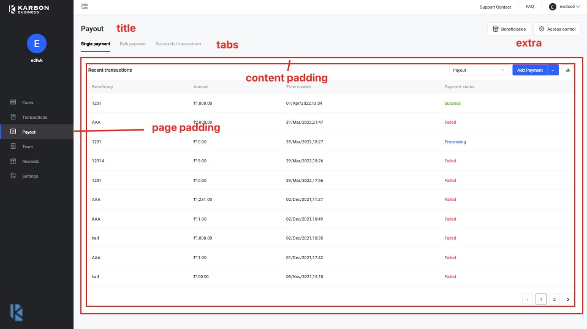

# PageContainer 页容器

**为什么设计这个组件?**

原因是在前端写页面时，我们总是会遇到相同的页面逻辑。比如：

1. 页面一般会有一个 title，当然也可能没有
2. 页面自身有 padding 值（根据 UI 稿来看，left 和 right 一般是 24px-32px 不等，top 和 bottom 为 20-24px 不等）
3. 页面 content 区域 padding 为 (16px、24px)
4. title 的右侧可能会有几个 Button，我们称之为 extra 区
5. title 下面可能有 tabs 标签

一个很典型的例子是 payout 页面



其他页面可能对应 payout 会少了部分内容，比如 tabs、extra 等。

但是页面的 padding 和 content 的 padding 则是不可或缺的。

这也是设计这个组件的原因。

**设计标准**

由于组件只是基于 antd 的二次封装，我们只需要考虑将 UI 处并不统一的 padding 值给做成一致的即可。

为了简便，我在此将 page-padding 与 content-padding 都设计为 24px

其余只是 API 的组合处理了。

在此基础上，为了通用性，尽可能得将使用权抛给使用者，组件内部除了样式，并没有内置太多的状态和副作用。

所有 API 都是非必选的。（如果是必选，那么 API 文档上会写必选）

## title 标题

```tsx
/**
 * desc: 如果没有 title，那么仅剩 page padding 和 content padding
 * compact: true
 * background: 'rgb(246, 247, 249)'
 */
import React from 'react';
import { PageContainer } from 'karbon-components';
export default () => <PageContainer title="Transactions">我是内容</PageContainer>;
```

## extra 额外扩展

```tsx
/**
 * desc: extra 就是右侧的两个按钮，内部用了 Space 组件做了分割，所以只需要传数组即可
 * compact: true
 * background: 'rgb(246, 247, 249)'
 */
import React from 'react';
import { PageContainer } from 'karbon-components';
import { Button } from 'antd';

export default () => (
  <PageContainer
    title="Transactions"
    extra={[<Button key="1">extra1</Button>, <Button key="2">extra2</Button>]}
  >
    我是内容,内容的 padding 为 24px
  </PageContainer>
);
```

## tabs 标签页

```tsx
/**
 * desc: tabs 的使用跟 ant design 的不太一样，具体看代码
 * compact: true
 * background: 'rgb(246, 247, 249)'
 */
import React, { useState } from 'react';
import { PageContainer } from 'karbon-components';
enum Keys {
  SUCCESS = 'successful',
  REJECTED = 'rejected',
}

export default () => {
  const [currentKey, setCurrentKey] = useState<Keys>(Keys.SUCCESS);
  const content = {
    successful: <div>我是内容 1</div>,
    rejected: <div>我是内容 2</div>,
  };

  return (
    <PageContainer
      title="Transactions"
      tabs={[
        { tab: 'Successful Transactions', key: Keys.SUCCESS },
        { tab: 'Rejected Transactions ', key: Keys.REJECTED },
      ]}
      tabProps={{
        defaultActiveKey: currentKey,
        onChange: (key: Keys) => setCurrentKey(key),
      }}
    >
      {content[currentKey]}
    </PageContainer>
  );
};
```

<API src='./PageContainer.tsx'>
